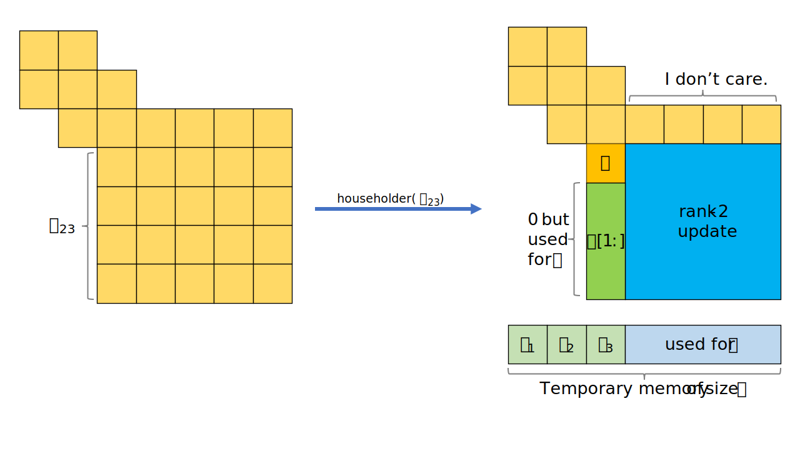

# Solving Hermitian Eigenvalue Problems

Jiaze Li, 4742380, Scientific Computing

***Abstract**: This project implements a Hermitian (or symmetric) eigensolver in C++ using Householder tridiagonalization followed by a shifted QR iteration with deflation. All memory for intermediate computations is pre-allocated, and most operations are done in-place to reduce overhead. The resulting algorithm accurately finds both eigenvalues and eigenvectors on test matrices, with performance (time and precision) that matches Armadillo (and hence LAPACK) in many small-to-mid-sized problems. At larger dimensions (e.g. $N=1000$), performance lags behind LAPACK-based routines. Likely due to LAPACK’s highly optimized BLAS usage.*

## Method

Let $A$ be a Hermitian (or symmetric) $n \times n$ matrix. A scalar $\lambda$ is called an **eigenvalue** and a nonzero column vector $z$ the corresponding **eigenvector** if $Az = \lambda z$. $\lambda$ is always real in our case since $A$ is Hermitian. 

The basic task of the Hermitian eigenvalue problem routines is to compute values of $\lambda$ and, optionally, corresponding vectors $z$ for a given matrix $A$. Therefore we reformulate the problem as a eigendecomposition $A = Z \Lambda Z^*$, where $\Lambda$ is a diagonal matrix and $Z$ is a unitary matrix with each column as an eigenvector. This calculation is done by the following steps:

1. Reduce the Hermitian matrix $A$ into (real) tridiagonal form $T$ i.e. $A = U T U^*$;
2. Solve the eigen decomposition of $T$ i.e. $T = Q \Lambda Q^\top$. $\Lambda$ contains the eigenvalues of $T$, which are also the eigenvalues of $A$, since the first step is a similarity transformation;
3. (Optional) Compute the eigenvectors of $A$ which are the columns of $Z = U Q$. (If there is no need to compute eigenvectors, there is no need to store $U$ and $Q$)

### Householder Tridiagonalization

If $A$ is Hermitian, we construct a unitary matrix $U$ s.t. 
$$
U^* A U = T
$$
is tridiagonal. Here we use Householder reflector to construct $U$. Suppose that Householder matrices $H_1, ..., H_{k-1}$ has been determined s.t.

$$
A_{k-1}=\left(H_1 \cdots H_{k-1}\right)^* A\left(H_1 \cdots H_{k-1}\right),
$$
is tridiagonal through its first $k-1$ columns.
$$
A_{k-1} =
\begin{bmatrix}
B_{11} & B_{12} & 0 \\
B_{21} & B_{22} & B_{23} \\
0 & B_{32} & B_{33}
\end{bmatrix}
\quad
\begin{array}{c}
_{k-1} \\
_{1} \\
_{n-k}
\end{array}
$$
If $\tilde{H}_k$ is an $(n-k)$-order Householder matrix s,t, $\tilde{H}_k^*B_{32} = [\beta, 0, ..., 0]^\top$ where $\beta = ||B_{32}||_2 \in \mathbb{R}$ and if $H_k = \text{diag}(I_k, \tilde{H}_k)$, then
$$
A_k = H_k^* A_{k-1} H_k =
\begin{bmatrix}
B_{11} & B_{12} & 0 \\
B_{21} & B_{22} & B_{23} \tilde{H}_k \\
0 & \tilde{H}_k^* B_{32} & \tilde{H}_k^* B_{33} \tilde{H}_k
\end{bmatrix}
\quad
\begin{array}{c}
_{k-1} \\
_1 \\
_{n-k}
\end{array}
$$
is tridiagonal through its first $k$ columns. Therefore, if $U = H_1 \cdots H_{n-2}$, then $U^* A U = T$ is real tridiagonal.

In the calculation of $A_k$ it is important to exploit symmetry during the formation of the matrix $\tilde{H}_k^* B_{33} \tilde{H}_k$ (rank-2 update). To be specific, as a Householder reflection, $\tilde{H}_k$ has the form
$$
\tilde{H}_k=I-\tau u u^*, \quad \tau=2 / u^* u, \quad 0 \neq u \in \mathbb{C}^{n-k} .
$$
Note that if $p=\tau^* B_{33} u$ and $w=p-\left(\tau p^* u / 2\right) u$, then

$$
\tilde{H}_k^* B_{33} \tilde{H}_k=B_{33}-u w^*-w u^* .
$$

### QR Iteration with Shifts and Deflation

Once the tridiagonal matrix $T$ is obtained, we construct a orthogonal matrix $Q$ s.t. 
$$
Q^\top T Q = \Lambda
$$
is diagonal. We use QR iteration to construct $Q$ and compute $\Lambda$, or in other words, with Givens rotation
$$
T'=G_{\text{all}}^\top T G_{\text{all}},\quad G_{\text{all}}=G_{1, 2} \cdots G_{n-1, n}
$$
until it converge to $\Lambda$.

To ensure convergence, we use the (implicit) Wilkinson shift (2.5.11 Theorem).

To reduce computation, we detect the largest unreduced part before each QR step (deflation). In the program, it's hard to iterate until the sub-diagonal is exactly 0, so we set
$$
h_{i, i-1}=0, \quad \text { where } \quad\left|h_{i, i-1}\right| \leq \text{eps}\left(\left|h_{i, i}\right|+\left|h_{i-1, i-1}\right|\right)
$$

## Implementation Details

> "Computer programming is an art, because it applies accumulated knowledge to the world, because it requires skill and ingenuity, and especially because it produces objects of beauty."
> — Donald Knuth

This chapter is about the details used in the code that reduce computation and memory usage, and improve numerical stability. For full implementation please refer to the code.

### Templates

The entire program is implemented through template classes or functions e.g.

```C++
template<typename MatrixType>
class HermitianEigenSolver;
```

The advantage of using classes is that all memory, including that needed for temporary variables (see Workspace), is requested at the initialization. The advantage of using templates is that the entire eigenproblem solver can be applied to different kinds of dense matrices, real symmetric or Hermitian matrices with both single and double precision. One more advantage is that many functions can take not only `arma::Mat` as arguments, but also `arma::subview` and its references, which reduces lots of memory copy.

### Workspace

At an instance of `HermitianEigenSolver` is initialized, we request a `Scalar` (can be complex) vector of size $2N$ as a workspace

```C++
VectorType mWorkspace;
mWorkspace(2 * matrix.n_cols);
```

In subsequent computations, (almost) all of the temporary variables will be stored on workspace to reuse memory and control the total usage.

### Tridiagonalization

When doing tridiagonalization, the outermost function is as follow

```C++
template<typename MatrixType, typename RealVectorType, typename VectorType>
void tridiagonalization(MatrixType &A,
                        RealVectorType &diag,
                        RealVectorType &sub_diag,
                        VectorType &workspace,
                        bool withQ);
```

where the main and sub diagonals are returned by 2 vectors rather than dense `arma::Mat`. Also $Q$ is returned by `A` if it needs to be constructed.

As mentioned before, we keep reflect on $B_{32}$ in every step using Householder. Note that Householder has some special structure, $H v = [\beta, 0, ... , 0]^\top$ where $H = I-\tau u u^*$ and $u = [1, ...] ^\top$. Combining this special structure with the need for temporary variables, the entire tridiagonalization process requires only memory of additional size $N$. An example step is shown below.




```c++
VectorType Householders(workspace.memptr(), n - 1, false, false);
```

This temporary variable is malloced on `workspace`, and at step $k$, its first $k-1$ elements store the previous $\tau$, while the remainder is used for the temporary variable $w$ (see rank-2 update).

When updating the matrix, we don't care about the result of $B_{23} \tilde{H}_k$, but only about $\tilde{H}_k^* B_{33} \tilde{H}_k$. 

```c++
// w = conj(tau) * A[i+1:, i+1:] * u
Householders.tail(remain) = subA * (scalar_conj(tau) * tail);
```

Here we first do the scalar product to vector, then matrix multiply. This is because scalar product to matrix is much more computationally cost than scalar product to vector. Writing directly following the formula will increase the computation due to the fact that `*` is left associative in `C++`.

```
arma::Mat<Scalar> uw = tail * Householders.tail(remain).t();
subA -= (uw + uw.t());
```

For $\tilde{H}_k^* B_{33} \tilde{H}_k=B_{33}-u w^*-w u^*$, but don't compute $uw^*$ and $wu^*$ twice as they are conjugate transposed. Also here it is possible to update only the upper diagonal of $B_{33}$ in recovering the complete matrix, but I haven't found a good way.

### Householder Reflector

For a given vector $v$, construct a Householder Reflector $H$ s.t. $H v = [\beta, 0, ... , 0]^\top$, but instead of explicitly storing $H$, store $\tau$ and $u$ s.t. $H = I-\tau u u^*$

```C++
template<typename VectorType, typename Scalar, typename RealScalar>
void make_Householder(VectorType &vector, Scalar &tau, RealScalar &beta);
```

Here we reuse `vector` for both input $v$ and output $u$.

If eigenvectors are required, we should also construct the matrix $Q = H_{n-2} \cdots H_1$ or $Q = H_{n-2} \cdots H_1 I$, and since there is no explicit $H$, we need the following function for matrix $M$ s.t. $M = H M$

```C++
template<typename MatrixType, typename VectorType, typename Scalar>
void apply_Householder_left(MatrixType &M,
                            const VectorType &v,
                            const Scalar &tau,
                            Scalar *workspace);
```

Note that the `v` here is not the full $u$, but is missing the first element. Still it is a reference from $B_{32}[1:]$, whose first element should correctly store the sub-diagonal elements.

### Givens Rotation

Constructing a Givens rotation s.t. $G^\top (a, b)^\top = (r, 0)^\top$. The case of complex numbers is not considered here, since the tridiagonal matrix is already real. But it should be able to apply to complex matrix.

```C++
template<typename Scalar>
inline void make_givens(const Scalar &a, const Scalar &b,
                        Scalar &c, Scalar &s);
```

This time, for computing the eigenvectors, we no longer need left-multiply, but instead right-multiply $Q = Q G$

```C++
// A = A * G
template<typename Scalar, typename RealScalar>
void apply_givens_right(Scalar *matrix_ptr,
                        Index n_rows,
                        Index p, Index q,
                        const RealScalar &c, const RealScalar &s);
```

Here the property that the dense matrix of Armadillo are column-major order is utilized. The purpose of using pointers is to allow further less passing of parameters compared to `arma::Mat` references.

### Scaling

Before starting, we scale the matrix to avoid overflow and scale the eigenvalues back when everything is done. 

```C++
mat = matrix;
RealScalar scale = arma::abs(mat).max();
if (scale == RealScalar(0))
    scale = RealScalar(1);
mat /= scale;
...
mEigenValues *= scale;
```

### Deflation

We perform each QR step only on the largest unreduced block, specifically, pointing out where the QR step starts and ends based on two indices.

```c++
for (Index i = start; i < end; ++i) {
    if (std::abs(sub_diag[i]) <= eps * (std::abs(diag[i]) + std::abs(diag[i + 1])))
        sub_diag[i] = RealScalar(0);
}
// find the largest unreduced block
while (end > 0 && (sub_diag[end - 1] == RealScalar(0)))
    end--;
if (end <= 0)
    break;
start = end - 1;
while (start > 0 && (sub_diag[start - 1] != RealScalar(0)))
    start--;
```

### QR Step

A complete QR step is implemented by the following function

```C++
template<typename RealScalar, typename Scalar>
static void tri_diag_qr_step(RealScalar *diag,
                             RealScalar *sub_diag,
                             Index start, Index end,
                             Scalar *Q, Index n);
```

In which the Wilkinson shift is done by

```C++
RealScalar td = (diag[end - 1] - diag[end]) * RealScalar(0.5);
RealScalar e = sub_diag[end - 1];
RealScalar mu = diag[end];
if (td == RealScalar(0)) {
    mu -= std::abs(e);
} else if (e != RealScalar(0)) {
    const RealScalar e2 = e * e;
    const RealScalar h = std::hypot(td, e);
    if (e2 == RealScalar(0)) {
        mu -= e / ((td + (td > RealScalar(0) ? h : -h)) / e);
    } else {
        mu -= e2 / (td + (td > RealScalar(0) ? h : -h));
    }
}
```

Instead of directly using the formula given in 2.5.7 Lemma
$$
\sigma=a_n+d-\operatorname{sign}(d) \sqrt{d^2+b_{n-1}^2}, \quad d=\frac{a_{n-1}-a_n}{2}.
$$
It is because scaling $d^2$ and $b_{n-1}^2$ will not overflow, but they may underflow.

## Verification and Testing

### Generate Test Matrix

We generate random Hermitian matrices based on the given eigenvalues by the following method.

For given eigenvalues $\lambda = [\lambda_1, ..., \lambda_n]^\top$, where $\lambda_i \in \mathbb{R}$. Create a matrix $\Lambda$ with eigenvalues on the diagonal
$$
\Lambda=\left[\begin{array}{cccc}
\lambda_1 & 0 & \cdots & 0 \\
0 & \lambda_2 & \cdots & 0 \\
\vdots & \vdots & \ddots & \vdots \\
0 & 0 & \cdots & \lambda_n
\end{array}\right].
$$
A random Gaussian matrix $G$ (with elements independently sampled from a standard normal distribution) is used to generate an unitary matrix $Q$ via QR decomposition:

$$
{G}={Q} {R}
$$

Finally we get the random Hermitian matrix $A$ with
$$
A = Q \Lambda Q^*.
$$

### Evaluation

Suppose we have a Hermitian matrix $A \in \mathbb{C}^{n \times n}$. Let $\left\{\lambda_1^{(\exp )}, \ldots, \lambda_n^{(\exp )}\right\}$ denote the exact eigenvalues of $A$, and $\left\{\lambda_1^{(\mathrm{comp})}, \ldots, \lambda_n^{(\mathrm{comp})}\right\}$ denote the computed eigenvalues. Let $V$ be the unitary matrix whose columns are the corresponding computed eigenvectors, and define

$$
D=\operatorname{diag}\left(\lambda_1, \ldots, \lambda_n\right)
$$

containing the computed eigenvalues on the diagonal.

1. Eigenvalue Error

   We sort both the exact and computed eigenvalues in ascending order, and then the following maximum relative error is computed:

   $$
   E_{\mathrm{values}}=\max _{1 \leq i \leq n}\left\{\frac{\left|\lambda_i^{(\exp )}-\lambda_i^{(\text {comp })}\right|}{\left|\lambda_i^{(\exp )}\right|}\right\}
   $$

2. Eigenvector Error

   With the computed eigenvector matrix $V$ and the diagonal matrix $D$, we reconstruct a matrix $B$ :
   $$
   B=V D V^*
   $$

Since $A$ is Hermitian, the ideal decomposition would be $A=V D V^*$ if the computed eigenvectors and eigenvalues were exact. To measure the discrepancy between $A$ and $B$, we uses the $\infty$-norm `arma::norm(X, "inf")` of their difference:

$$
   E_{\text {vectors }}=\|A-B\|_{\infty}
$$

### Test Results

The program was tested on the following cases and compared to `eig_sym()` in Armadillo.

#### Simple Case

The random Gaussian eigenvalues $\lambda = [\lambda_1, ..., \lambda_n]^\top$ (with elements independently sampled from a standard normal distribution). In this case, we tested matrix sizes from 10 to 1000 and the results are as follows. All test results are averaged over five runs.

When computing only the eigenvalues and without the eigenvectors, the results are shown in the table below.  At matrix sizes less equal than 100, the performance of this method is almost equal to Armadillo, and especially better in terms of precision. However, a significant gap appears in size 1000.

| $N$  | data type | $t_\text{arma}$ | $t_\text{mine}$ | $E_\text{arma}$ | $E_\text{mine}$ |
| :--: | :-------: | :-------------: | :-------------: | :-------------: | :-------------: |
|  10  |     f     |    8.75E-06     |  **5.50E-06**   |    3.39E-06     |  **1.81E-06**   |
|  10  |     d     |    1.14E-05     |  **6.87E-06**   |    1.28E-15     |  **5.70E-16**   |
|  10  |    cf     |  **8.48E-06**   |    9.06E-06     |  **6.36E-07**   |    8.24E-07     |
|  10  |    cd     |    1.22E-05     |  **8.51E-06**   |    2.93E-15     |  **8.19E-16**   |
| 100  |     f     |  **2.65E-04**   |    5.43E-04     |    1.02E-04     |  **2.39E-05**   |
| 100  |     d     |    6.90E-04     |  **5.99E-04**   |  **6.02E-15**   |    1.89E-14     |
| 100  |    cf     |  **8.11E-04**   |    1.14E-03     |    1.97E-05     |  **8.63E-06**   |
| 100  |    cd     |  **7.98E-04**   |    1.06E-03     |    2.01E-14     |  **1.53E-14**   |
| 1000 |     f     |  **9.10E-02**   |    5.54E-01     |  **7.11E-05**   |    9.71E-05     |
| 1000 |     d     |  **1.52E-01**   |    7.06E-01     |    2.69E-13     |  **1.25E-13**   |
| 1000 |    cf     |  **3.65E-01**   |    1.47E+00     |  **3.90E-05**   |    4.00E-05     |
| 1000 |    cd     |  **4.44E-01**   |    2.36E+00     |    1.35E-13     |  **1.23E-13**   |

where f = float, d = double, cf = complex float, cd = complex double.

When computing  also the eigenvectors, method in Armadillo is definitely better.

| $N$  | data type | $t_\text{arma}$ | $t_\text{mine}$ | $E_\text{arma}$ | $E_\text{mine}$ |
| :--: | :--: | :----------: | :----------: | :----------: | :----------: |
|  10  |  f   |   1.46E-05   | **8.33E-06** | **1.28E-06** |   2.72E-06   |
|  10  |  d   |   1.26E-05   | **8.70E-06** | **4.45E-15** |   2.23E-15   |
|  10  |  cf  | **1.42E-05** |   2.38E-05   | **1.61E-06** |   2.35E-06   |
|  10  |  cd  | **1.74E-05** |   2.08E-05   |   6.61E-15   | **5.70E-15** |
| 100  |  f   | **6.46E-04** |   9.71E-04   | **1.56E-05** |   1.21E-04   |
| 100  |  d   |   1.41E-03   | **1.16E-03** | **3.52E-14** |   1.47E-13   |
| 100  |  cf  | **1.66E-03** |   2.21E-03   | **1.23E-05** |   7.43E-05   |
| 100  |  cd  | **1.85E-03** |   2.68E-03   | **2.54E-14** |   1.76E-13   |
| 1000 |  f   | **1.84E-01** |   9.44E-01   | **6.32E-05** |   1.21E-03   |
| 1000 |  d   | **3.17E-01** |   1.46E+00   | **1.28E-13** |   2.05E-12   |
| 1000 |  cf  | **1.07E+00** |   3.17E+00   | **1.03E-04** |   1.17E-03   |
| 1000 |  cd  | **1.53E+00** |   5.82E+00   | **2.35E-13** |   2.20E-12   |

#### Hard Case

When there are clusters in the spectrum, that is, there are multiple eigenvalues. For this case, we first test $\lambda = [1, ..., 1]^\top$. After success ($E_{\mathrm{values}} < 0.01$), let $\lambda_1 = \lambda_1 / 10$ and keep doing this until the method failed. Because of scaling, larger eigenvalues or matrix elements do not matter, but underflow may still occur when the condition number is large.

The limits of my method and armadillo's are as follows

|  Method   | float | double | complex float | complex double |
| :-------: | :---: | :----: | :-----------: | :------------: |
| Armadillo | 1E-06 | 1E-14  |     1E-05     |     1E-14      |
|   Mine    | 1E-06 | 1E-14  |     1E-06     |     1E-14      |

For unavoidable underflow, the limits of my approach and Armadillo's approach are almost the same.

## Conclusion

This project accomplished an algorithm to efficiently compute eigenvalues and eigenvectors of Hermitian matrices. Eigen-decomposition of matrices was achieved using tridiagonalization and QR iteration. The final performance is comparable to Armadillo or LAPACK for matrix sizes less than 100. Analysing the gap with Armadillo for larger matrices, I think it may be in the vectorization processing. Mainly Armadillo uses BLAS in its implementation, but I couldn't make good use of that.

## Supplementary Code

HermitianEigenSolver.h

```c++
#ifndef HERMITIAN_EIGEN_SOLVER_H
#define HERMITIAN_EIGEN_SOLVER_H

#include "tridiagonalization.h"
#include "givens.h"
#include "base.h"

/**
 * @brief One symmetric tridiagonal QR step with implicit Wilkinson shift
 *
 * @param diag the diagonal vector of the input tridiagonal matrix
 * @param sub_diag the sub-diagonal vector of the input tridiagonal matrix
 * @param start starting index to work on
 * @param end last+1 index to work on
 * @param Q pointer to the column-major matrix with eigenvectors,
 * set to 0 if no eigenvectors need
 * @param n size of the input matrix
 */
template<typename RealScalar, typename Scalar>
static void tri_diag_qr_step(RealScalar *diag,
                             RealScalar *sub_diag,
                             Index start, Index end,
                             Scalar *Q, Index n);

/**
 * @brief Solve EVP for a tridiagonal matrix
 *
 * @param[in,out] diag Input of the main diagonal, output of the eigenvalues
 * @param[in,out] sub_diag Input of the sub diagonal
 * @param[in] max_iter The maximum number of iterations
 * @param[in] do_vectors Whether the eigenvectors have to be computed or not
 * @param[out] eigenvectors The matrix to store the eigenvectors as column vectors
 */
template<typename MatrixType, typename RealVectorType>
void eigen_tri_diag(RealVectorType &diag,
                    RealVectorType &sub_diag,
                    Index max_iter,
                    bool do_vectors,
                    MatrixType &eigenvectors);

/**
 * @brief Computes eigenvalues and eigenvectors of Hermitian matrices
 * 
 * @tparam MatrixType 
 */
template<typename MatrixType>
class HermitianEigenSolver {
public:
    typedef typename MatrixType::elem_type Scalar;
    typedef typename arma::get_pod_type<Scalar>::result RealScalar;
    typedef arma::Col<Scalar> VectorType;
    typedef arma::Col<RealScalar> RealVectorType;

    /**
     * @brief Construct a new Hermitian Eigen Solver
     * 
     * @param[in] matrix A Hermitian matrix
     * @param[in] computeVectors true (default) for compute eigenvectors
     * as well or false compute eigenvalues only
     */
    explicit HermitianEigenSolver(const MatrixType &matrix, bool computeVectors = true)
            : mEigenVectors(matrix.n_rows, matrix.n_cols),
              mWorkspace(2 * matrix.n_cols),
              mEigenValues(matrix.n_cols),
              mSubDiag(matrix.n_rows > 1 ? matrix.n_rows - 1 : 1) {
        compute(matrix, computeVectors);
    }

    HermitianEigenSolver &compute(const MatrixType &matrix, bool computeVectors = true);

    /**
     * @brief Return a const reference to the matrix whose columns are the eigenvectors
     * 
     * @return const MatrixType& 
     */
    const MatrixType &eigenvectors() const {
        return mEigenVectors;
    }

    /**
     * @brief Return a const reference to the column vector containing the eigenvalues
     * 
     * @return const RealVectorType&
     */
    const RealVectorType &eigenvalues() const {
        return mEigenValues;
    }

    static const Index mMaxIterations = 30; // full max iterations is 30n, from LAPACK

protected:
    // TODO: Can we use fixed size for some of these?
    RealVectorType mEigenValues;
    MatrixType mEigenVectors;
    VectorType mWorkspace;
    RealVectorType mSubDiag;
};

template<typename MatrixType>
HermitianEigenSolver<MatrixType> &
HermitianEigenSolver<MatrixType>::compute(const MatrixType &matrix, bool computeVectors) {
    Index n = matrix.n_cols;

    if (n == 1) {
        mEigenVectors = matrix;
        mEigenValues(0) = std::real(matrix(0, 0));
    }

    RealVectorType &diag = mEigenValues;
    MatrixType &mat = mEigenVectors;

    mat = matrix;
    RealScalar scale = arma::abs(mat).max();
    if (scale == RealScalar(0))
        scale = RealScalar(1);
    mat /= scale;
    tridiagonalization(mat, diag, mSubDiag, mWorkspace, computeVectors);
    eigen_tri_diag(diag, mSubDiag, mMaxIterations, computeVectors, mEigenVectors);
    mEigenValues *= scale;
    return *this;
}

template<typename MatrixType, typename RealVectorType>
void eigen_tri_diag(RealVectorType &diag, RealVectorType &sub_diag,
                    Index max_iter, bool do_vectors,
                    MatrixType &eigenvectors) {
    typedef typename MatrixType::elem_type Scalar;
    typedef typename arma::get_pod_type<Scalar>::result RealScalar;
    Index n = diag.size();
    Index end = n - 1;
    Index start = 0;
    Index iter = 0;

    const RealScalar eps = std::numeric_limits<RealScalar>::epsilon();
    while (end > 0) {
        // Deflation
        // Scan the sub-diagonal for "zero"
        for (Index i = start; i < end; ++i) {
            if (std::abs(sub_diag[i]) <= eps * (std::abs(diag[i]) + std::abs(diag[i + 1])))
                sub_diag[i] = RealScalar(0);
        }

        // find the largest unreduced block
        while (end > 0 && (sub_diag[end - 1] == RealScalar(0)))
            end--;
        if (end <= 0)
            break;
        start = end - 1;
        while (start > 0 && (sub_diag[start - 1] != RealScalar(0)))
            start--;

        tri_diag_qr_step(diag.memptr(), sub_diag.memptr(), start, end,
                         do_vectors ? eigenvectors.memptr() : nullptr, n);

        if (++iter > max_iter * n) {
            std::cerr << "Warning: The QR algorithm did not converge" << std::endl;
            break;
        }
    }
}

template<typename RealScalar, typename Scalar>
static void tri_diag_qr_step(RealScalar *diag,
                             RealScalar *sub_diag,
                             Index start, Index end,
                             Scalar *Q, Index n) {
    // Wilkinson Shift
    RealScalar td = (diag[end - 1] - diag[end]) * RealScalar(0.5);
    RealScalar e = sub_diag[end - 1];
    // e^2 or td^2 can be underflow, so dont use mu = diag[end] - e*e / (td + (td>0 ? 1 : -1) * sqrt(td*td + e*e));
    RealScalar mu = diag[end];
    if (td == RealScalar(0)) {
        mu -= std::abs(e);
    } else if (e != RealScalar(0)) {
        const RealScalar e2 = e * e;
        const RealScalar h = std::hypot(td, e);
        if (e2 == RealScalar(0)) {
            mu -= e / ((td + (td > RealScalar(0) ? h : -h)) / e);
        } else {
            mu -= e2 / (td + (td > RealScalar(0) ? h : -h));
        }
    }

    // See the proof of Theorem 2.5.11
    RealScalar x = diag[start] - mu;
    RealScalar z = sub_diag[start];
    for (Index k = start; k < end && z != RealScalar(0); ++k) {
        RealScalar c, s;
        // If z is zero, Givens will make it remain zero.
        make_givens(x, z, c, s);

        // A = G A G^T
        RealScalar sdk = s * diag[k] + c * sub_diag[k];
        RealScalar dkp1 = s * sub_diag[k] + c * diag[k + 1];

        diag[k] = c * (c * diag[k] - s * sub_diag[k]) - s * (c * sub_diag[k] - s * diag[k + 1]);
        diag[k + 1] = s * sdk + c * dkp1;
        sub_diag[k] = c * sdk - s * dkp1;

        if (k > start)
            sub_diag[k - 1] = c * sub_diag[k - 1] - s * z;

        // Bulge chasing back to Hessenberg form
        x = sub_diag[k];
        if (k < end - 1) {
            z = -s * sub_diag[k + 1];
            sub_diag[k + 1] = c * sub_diag[k + 1];
        }

        // apply the givens rotation to the unitary matrix Q = Q * G
        if (Q) {
            apply_givens_right(Q, n, k, k + 1, c, s);
        }
    }
}

#endif // HERMITIAN_EIGEN_SOLVER_H
```

base.h

```c++
#ifndef BASE_H
#define BASE_H

#include <cstddef>
#include <armadillo>
#include <limits>
#include <cmath>
#include <complex>

typedef std::ptrdiff_t Index;

template<typename T>
T scalar_conj(const T &x) {
    return x;
}

template<typename T>
std::complex<T> scalar_conj(const std::complex<T> &x) {
    return std::conj(x);
}

#endif //BASE_H
```

givens.h

```c++
#ifndef GIVENS_ROTATION_H
#define GIVENS_ROTATION_H

#include "base.h"

/**
 * @brief Make a Givens Rotation s.t. G^T (a, b)^T = (r, 0)^T
 * 
 * @tparam Scalar The type of the input values (should be real)
 * @param[in] a The first value
 * @param[in] b The second value
 * @param[in] c The cosine component of G
 * @param[in] s The sine component of G
 */
template<typename Scalar>
inline void make_givens(const Scalar &a, const Scalar &b, Scalar &c, Scalar &s) {
    using std::abs;
    using std::sqrt;
    if (b == Scalar(0)) {
        c = a < Scalar(0) ? Scalar(-1) : Scalar(1);
        s = Scalar(0);
    } else if (a == Scalar(0)) {
        c = Scalar(0);
        s = b < Scalar(0) ? Scalar(1) : Scalar(-1);
    } else if (abs(a) > abs(b)) {
        Scalar t = b / a;
        Scalar u = sqrt(Scalar(1) + t * t);
        if (a < Scalar(0))
            u = -u;
        c = Scalar(1) / u;
        s = -t * c;
    } else {
        Scalar t = a / b;
        Scalar u = sqrt(Scalar(1) + t * t);
        if (b < Scalar(0))
            u = -u;
        s = -Scalar(1) / u;
        c = -t * s;
    }
}

/**
 * @brief Apply the Givens rotation with c and s to the columns p and q of matrix, i.e. A = A * G
 * 
 * @tparam Scalar The type of the matrix values (can be complex)
 * @tparam RealScalar The type of the rotation parameters (only real)
 * @param matrix_ptr Pointer to the first element of the matrix
 * (Armadillo dense matrix is stored in column-major order)
 * @param n_rows Number of rows in the matrix
 * @param p Index of the first column
 * @param q Index of the second column
 * @param c The cosine component of G
 * @param s The sine component of G
 */
template<typename Scalar, typename RealScalar>
void apply_givens_right(Scalar *matrix_ptr, Index n_rows,
                        Index p, Index q,
                        const RealScalar &c, const RealScalar &s) {
    if (c == Scalar(1) && s == Scalar(0)) return;

    for (Index i = 0; i < n_rows; ++i) {
        Scalar *row_ptr = matrix_ptr + i;
        Scalar x = row_ptr[p * n_rows];
        Scalar y = row_ptr[q * n_rows];

        row_ptr[p * n_rows] = c * x - s * y;
        row_ptr[q * n_rows] = s * x + c * y;
    }
}

#endif // GIVENS_ROTATION_H
```

householder.h

```c++
#ifndef HOUSEHOLDER_H
#define HOUSEHOLDER_H

#include "base.h"

/**
 * @brief Make a reflector H s.t. H v = ||v|| e1 = [beta, 0, ..., 0]^T
 * where H = I - tau u u^*, see Golub's "Matrix Computations" algorithm 5.1.1.
 * 
 * @param[in,out] vector The input v and the output u with u[1:] in v[1:]
 * @param tau The scalar factor of the Householder
 * @param beta The norm of v
 */
template<typename VectorType, typename Scalar, typename RealScalar>
void make_householder(VectorType &vector, Scalar &tau, RealScalar &beta) {
    const Index n = vector.n_elem;
    if (n == 0) {
        tau = Scalar(0);
        beta = RealScalar(0);
        return;
    }

    Scalar c0 = vector[0];
    RealScalar tail_abs2 = RealScalar(0);
    if (n > 1) {
        tail_abs2 = arma::norm(vector.subvec(1, n - 1)) * arma::norm(vector.subvec(1, n - 1));
    }

    const RealScalar tol = std::numeric_limits<RealScalar>::min();
    if ((tail_abs2 <= tol) && ((std::imag(c0) * std::imag(c0)) <= tol)) {
        // If is already "done"
        tau = Scalar(0);
        beta = std::real(c0);
        if (n > 1)
            vector.subvec(1, n - 1).zeros();
    } else {
        // beta = -sign(real(c0)) * ||v||_2
        // std::norm() is the absolute square not the Euclidean norm
        beta = std::sqrt(std::norm(c0) + tail_abs2);
        if (std::real(c0) >= RealScalar(0)) {
            beta = -beta;
        }
        if (n > 1) {
            vector.subvec(1, n - 1) /= (c0 - beta);
        }
        tau = scalar_conj((beta - c0) / beta);
    }
}

/**
 * @brief A = H A where H = I - tau u u^* and u = [1 v]
 * 
 * @param A The input matrix
 * @param v Tail of the Householder vector
 * @param tau The scalar factor of the Householder
 * @param workspace Pointer for memory reuse with at least A.n_cols entries
 */
template<typename MatrixType, typename VectorType, typename Scalar>
void apply_householder_left(MatrixType &A,
                            const VectorType &v,
                            const Scalar &tau,
                            Scalar *workspace) {
    if (A.n_rows == 1) {
        A *= (Scalar(1) - tau);
        return;
    }
    if (tau == Scalar(0)) {
        return;
    }
    arma::Row<Scalar> tmp(workspace, A.n_cols, false, false);
    arma::subview<Scalar> bottom = A.rows(1, A.n_rows - 1);
    tmp = v.t() * bottom;
    tmp += A.row(0);
    A.row(0) -= tau * tmp;
    bottom -= tau * v * tmp;
}

#endif  // HOUSEHOLDER_H
```

tridiagonalization.h

```c++
#ifndef TRIDIAGONALIZATION_H
#define TRIDIAGONALIZATION_H

#include <armadillo>
#include "base.h"
#include "householder.h"

/**
 * @brief Tridiagonalization the Hermitian matrix A s.t. A = Q T Q*
 * 
 * @param[in, out] A The input Hermitian matrix and the output Q matrix
 * @param[out] diag The diagonal of T
 * @param[out] sub_diag The subdiagonal of T
 * @param[in] workspace Pointer for memory reuse with at least 2 * A.n_cols entries
 * @param[in] withQ If true, store the matrix Q in A
 */
template<typename MatrixType, typename RealVectorType, typename VectorType>
void tridiagonalization(MatrixType &A, RealVectorType &diag, RealVectorType &sub_diag,
                        VectorType &workspace, bool withQ) {
    typedef typename MatrixType::elem_type Scalar;
    typedef typename arma::get_pod_type<Scalar>::result RealScalar;
    Index n = A.n_rows;
    // Need n - 1 more scalars for householder coefficients and tmp w
    VectorType householders(workspace.memptr(), n - 1, false, false);
    // Use Householder reflection to eliminate elements below the subdiagonal
    for (Index i = 0; i < n - 1; ++i) {
        Index remain = n - i - 1; // In column i size(TBD) = n - i - 1
        arma::subview_col<Scalar> tail = A.col(i).tail(remain);

        RealScalar beta;
        Scalar tau;
        make_householder(tail, tau, beta);

        A(i + 1, i) = Scalar(1); // Reconstruct the Householder vector u in A[i+1:, i]

        // Apply H to A[i+1:, i+1:] A = H A H*, see Golub's "Matrix Computations" Chapter 5.1.4
        arma::subview<Scalar> A_sub = A.submat(i + 1, i + 1, n - 1, n - 1);

        // do scalar * vector firstly to avoid scalar * matrix, since "*" is left associative in C++
        householders.tail(remain) = A_sub * (scalar_conj(tau) * tail);
        Scalar alpha = scalar_conj(tau) * RealScalar(-0.5) *
            arma::cdot(householders.tail(remain), tail);
        householders.tail(remain) += alpha * tail;
        arma::Mat<Scalar> uw = tail * householders.tail(remain).t();
        A_sub -= (uw + uw.t());

        sub_diag(i) = beta;
        householders(i) = tau; // Now householders[:i] is useless so use it to store tau
    }
    diag = arma::real(A.diag());
    if (withQ) {
        // Q = H_n-1 ... H_1 I
        MatrixType Q = arma::eye<MatrixType>(n, n);
        Index num_vec = n - 1;
        for (Index k = num_vec - 1; k >= 0; --k) {
            arma::subview<Scalar> Q_sub = Q.submat(k + 1, k + 1, n - 1, n - 1);
            arma::subview_col<Scalar> u = k + 2 < n ? A.col(k).subvec(k + 2, n - 1) :
            A.col(k).subvec(0, 0);
            apply_householder_left(
                Q_sub, u,
                scalar_conj(householders(k)),
                workspace.memptr() + n);
        }
        A = Q;
    }
}


#endif // TRIDIAGONALIZATION_H
```

test.h

```c++
#include <iostream>
#include <typeinfo>
#include <armadillo>
#include "HermitianEigenSolver.h"

template<typename RealScalar, typename Scalar>
arma::Mat<Scalar> generate_hermitian(arma::Col<RealScalar> eigen_values) {
    arma::uword n = eigen_values.n_elem;
    arma::Mat<Scalar> D(n, n, arma::fill::zeros);
    D.diag() = arma::conv_to<arma::Col<Scalar>>::from(eigen_values);
    auto rand = arma::randn<arma::Mat<Scalar>>(n, n);
    arma::Mat<Scalar> Q, _;
    arma::qr(Q, _, rand);
    arma::Mat<Scalar> A = Q * D * Q.t();
    return A;
}

template<typename RealScalar>
RealScalar compute_eigenvalue_error(const arma::Col<RealScalar> &expected_eigenvalues,
                                    const arma::Col<RealScalar> &computed_eigenvalues) {
    arma::Col<RealScalar> sorted_expected = arma::sort(expected_eigenvalues);
    arma::Col<RealScalar> sorted_computed = arma::sort(computed_eigenvalues);
    return arma::max(arma::abs(sorted_expected - sorted_computed) / arma::abs(sorted_expected));
}

template<typename RealScalar, typename Scalar>
RealScalar compute_eigenvector_error(const arma::Mat<Scalar> &matrix,
                                     const arma::Col<RealScalar> &eigenvalues,
                                     const arma::Mat<Scalar> &eigenvectors) {
    Index n = matrix.n_cols;
    arma::Mat<Scalar> D(n, n, arma::fill::zeros);
    D.diag() = arma::conv_to<arma::Col<Scalar>>::from(eigenvalues);
    arma::Mat<Scalar> B = eigenvectors * D * eigenvectors.t();
    return arma::norm(matrix - B, "inf");
}

template<typename Scalar>
void test_time_vectors(Index n) {
    typedef typename arma::get_pod_type<Scalar>::result RealScalar;
    constexpr int iterations = 5;

    arma::Col<RealScalar> eigenvalues(n, arma::fill::randn);
    auto A = generate_hermitian<RealScalar, Scalar>(eigenvalues);

    std::vector<double> arma_times, my_times;
    std::vector<double> arma_value_errors, arma_vector_errors;
    std::vector<double> my_value_errors, my_vector_errors;

    for (int i = 0; i < iterations; ++i) {
        arma::wall_clock timer;

        // Compute with Armadillo
        arma::Col<RealScalar> ev;
        arma::Mat<Scalar> evs;
        timer.tic();
        arma::eig_sym(ev, evs, A);
        arma_times.push_back(timer.toc());
        // arma_value_errors.push_back(compute_eigenvalue_error(eigenvalues, ev));
        arma_vector_errors.push_back(compute_eigenvector_error(A, ev, evs));

        // Compute with HermitianEigenSolver
        timer.tic();
        HermitianEigenSolver hes(A);
        my_times.push_back(timer.toc());
        // my_value_errors.push_back(compute_eigenvalue_error(eigenvalues, hes.eigenvalues()));
        my_vector_errors.push_back(
            compute_eigenvector_error(A, hes.eigenvalues(), hes.eigenvectors())
        );
    }

    auto compute_average = [](const std::vector<double>& values) {
        return std::accumulate(values.begin(), values.end(), 0.0) / values.size();
    };

    std::cout << "Armadillo time: " << compute_average(arma_times) << " seconds\n";
    // std::cout << "Armadillo eigenvalue error: " << compute_average(arma_value_errors) << "\n";
    std::cout << "Armadillo eigenvector error: " << compute_average(arma_vector_errors) << "\n";

    std::cout << "Custom solver time: " << compute_average(my_times) << " seconds\n";
    // std::cout << "Custom solver eigenvalue error: " << compute_average(my_value_errors) << "\n";
    std::cout << "Custom solver eigenvector error: " << compute_average(my_vector_errors) << "\n";
}

template<typename Scalar>
void test_time_values(Index n) {
    typedef typename arma::get_pod_type<Scalar>::result RealScalar;
    constexpr int iterations = 5;

    arma::Col<RealScalar> eigenvalues(n, arma::fill::randn);
    auto A = generate_hermitian<RealScalar, Scalar>(eigenvalues);

    std::vector<double> arma_times, my_times;
    std::vector<double> arma_value_errors;
    std::vector<double> my_value_errors;

    for (int i = 0; i < iterations; ++i) {
        arma::wall_clock timer;

        // Compute with Armadillo
        arma::Col<RealScalar> ev;
        timer.tic();
        arma::eig_sym(ev, A);
        arma_times.push_back(timer.toc());
        arma_value_errors.push_back(compute_eigenvalue_error(eigenvalues, ev));

        // Compute with HermitianEigenSolver
        timer.tic();
        HermitianEigenSolver hes(A, false);
        my_times.push_back(timer.toc());
        my_value_errors.push_back(compute_eigenvalue_error(eigenvalues, hes.eigenvalues()));
    }

    auto compute_average = [](const std::vector<double>& values) {
        return std::accumulate(values.begin(), values.end(), 0.0) / values.size();
    };

    std::cout << "Armadillo time: " << compute_average(arma_times) << " seconds\n";
    std::cout << "Armadillo eigenvalue error: " << compute_average(arma_value_errors) << "\n";

    std::cout << "Custom solver time: " << compute_average(my_times) << " seconds\n";
    std::cout << "Custom solver eigenvalue error: " << compute_average(my_value_errors) << "\n";
}


template<typename Scalar>
void test_hard() {
    typedef typename arma::get_pod_type<Scalar>::result RealScalar;
    // Arma Limit test
    {
        arma::Col<RealScalar> eigenvalues(10, arma::fill::ones);
        // eigenvalues.t().print("Expected Eigenvalues:");
        while (true) {
            eigenvalues(0) /= 10;
            auto A = generate_hermitian<RealScalar, Scalar>(eigenvalues);
            arma::Col<RealScalar> ev;
            arma::eig_sym(ev, A);
            // ev.t().print("Arma:");
            if (compute_eigenvalue_error(eigenvalues, ev) > 1e-2) {
                std::cout << "Armadillo Limit:" << eigenvalues(0) << std::endl;
                break;
            }
        }
    }
    // Custom Limit test
    {
        arma::Col<RealScalar> eigenvalues(10, arma::fill::ones);
        while (true) {
            eigenvalues(0) /= 10;
            auto A = generate_hermitian<RealScalar, Scalar>(eigenvalues);
            HermitianEigenSolver hes(A);
            // hes.eigenvalues().t().print("HES");
            if (compute_eigenvalue_error(eigenvalues, hes.eigenvalues()) > 1e-2) {
                std::cout << "Custom Limit:" << eigenvalues(0) << std::endl;
                break;
            }
        }
    }
}
```

